# detectprojv2j

### Software detectproj, version 1.3 (01/2026),
Moved from Java 8 to Java 25. Support of the inverse reprojection on selected projections. Reprojection by tiles is thread-safe

### detectproj, version 1.2.1 (02/2024),
Minor fixies and speed imrovements.

### detectproj, version 1.2(02/2022),
Improved performance of the projection analysis.

### detectproj, version 1.1.1 (08/2019),
Support of the inverse equations for the selected map projections (labeled by *). Experimantal support of the inverse reprojection on selected projections. An improved performance of the projection analysis. 10 new map projections have been added.

### detectproj, version 1.1 (01/2019),
Automated estimation of the map projection and its parameters based on the non-linear optimization.

### detectproj, version 1.09 (07/2017)
Extended identification of the projection. Results sortable according to determined parameters.

### detectproj, version 1.08 (05/2017)
Added 3 map projections: Behrmann, Miller, Wiechel. New graticule reconstruction algorithm.

### detectproj, version 1.07 (04/2017)
Added panning tool. Some minor fixies and convergence improvements.

### detectproj, version 1.06 (03/2017)
OSM issue fixed The Open Street Map loading issue has been fixed.

### detectproj, version 1.05 (03/2017)
Added 6 new map projections: Adams (3), Guyou, CWE, Littrow, Peirce. Some minor fixies and improvements.

### detectproj, version 1.04 (03/2017)
Setting multiple latitude/longitude interval + sampling step of generated meridians/parallels. Compare old and new versions. Multiple directions of the transformed longitude are supported. Graticule of the projection may be generated over the entitre planishere (not only inside the spherical quadrangle represented by min-max box).

### detectproj, version 1.03 (12/2016)
Support λ0 parameter for the oblique aspect of the projection. Compare old and new versions. 

### detectproj, version 1.02 (11/2016)
Added drag and drop support. Analyzed map. list of control points opened by drag and drop. 

 
### detectproj, version 1.01 (10/2016)
December 2, 2016: 12 new map projections are supported.

### detectproj, version 1.00 (9/2016)
First version of the detectproj. Convergence improvements for all detection methods.

## Features of the detectproj now include

<li>100 map projections are supported,</li>
<li>detection of the projection name and family,</li>
<li>estimation of the normal/transverse/oblique aspect of the projection,</li>
<li>detection of true parallels lat_1, lat_2,</li>
<li>detection of the central parallel shift lon_0,</li>
<li>estimation of the map scale, map rotation (optional),</li>
<li>2 detection methods,</li>
<li>3 optimization techniques,</li>
<li>fast detection in the separate thread,</li>
<li>two map windows side by side,</li>
<li>Open Street map client as the reference map,</li>
<li>drag and drop operations,</li>
<li>add/edit/delete control points,</li>
<li>list of candidate projections sorted by the residuals,</li>
<li>visualization of the detected parameters and residuals,</li>
<li>import/export of control points,</li>
<li>export reconstructed graticules in DXF,</li>
<li>setting latitude/longitude interval of the reconstructed graticule,</li>
<li>setting sampling sensitivity of the reconstructed meridians/parallels,</li>
<li>support multiple modes of the transformed longitude direction,</li>
<li>and many more... </li>
</ul>

## Determined parameters

Suppose the projection ℙ(φk, λk, φ1, φ2, λ0, κ) described by the set of constant values: transformed pole position [φk, λk], standard parallels φ1, φ2, longitude λ0 of the central meridian, constant parameter κ (may be assigned to any other determined value). Furthermore, suppose the analyzed map M(R′, ΔX, ΔY, α) described by its constant values: auxiliary sphere radius R′ (illustrating the scale ratio), origin shifts ΔX, ΔY, and angle of rotation α. For the oblique aspect, the projection equations in closed form may be written as functions of the determined parameters

X(R′, φk, λk, φ1, φ2, λ0, ΔX, κ, α) = F(φ′, λ′), Y(R′, φk, λk, φ1, φ2, λ0, ΔY, κ, α) = G(φ′, λ′).

<strong>Determined parameters of the projection</strong>

During the analysis, the bellow-mentioned constant parameters of the projection &nbsp;ℙ are determined. They have a strong influence on the shape of the graticule.

<ul>
<li>Transformed pole position [φk, λk] For the normal aspect, the arbitrary pole position is K=[ 90,0 ] is fixed; for the transverse aspect K=[ 0,? ] . Otherwise, both coordinates need to be determined.</li>
<li>Standard parallels φ1, φ2 The latitudes of two standard parallels, representing intersections of the cone, cylinder secant plane, are determined.</li>
<li>Longitude λ0 of the central meridian To minimize the distortion and provide a true projection of the mapped region, the central meridian may be shifted. It is frequently chosen in the axis of the symmetry of the mapped region.</li>
<li>Abitrary constant parameter κ It may represent any other constant value of the projection. </li>
</ul>

<strong>Determined parameters of the map</strong>

The constant parameters of the map represent its scale, shift, and rotation. They have only a low effect on the graticule shape.

<ul>
<li>Scale parameter R' It is determined so as to estimated projection graticule fits best with the analyzed one.</li>
<li>Rotation α An additional rotation of the analyzed map caused by the inappropriate insertion of the paper form of the map into the scanner. </li>
</ul>

## Detection methods

Determining the best fit projection parameters represents a complex problem leading to the convex/global unconstrained optimization of the objective function φ, describing the similarity of the analyzed and reference maps.

Let P ∈ M and Q ∈ S2 be the sets of features on the analyzed map M and on the sphere S2, ℙx:S2 → M′ be the analyzed projection, and P′ ∈ M′ be the image of Q in ℙx. The dissimilarity &nbsp;δx, δx ≥ 0,

δx = ϕ (ℙx(Q), P) = ϕ (P′x, P),

of features on the analyzed map M and on the sphere S2 projected with ℙ, is measured by the objective function ϕ at a point x. For each analyzed map projection ℙ, the vector of its best constant values

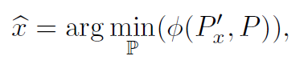

minimizing ϕ, may be determined. The minimized function is represented by the sum of the squares of residuals on the corresponding points

ϕ (P′x, P), = rTr.

Two types analyses are supported:

<ul>
<li>Method M7: 7 determined parameters of the projection (no rotation of the map is supposed).</li>
<li>Method M8: 8 determined parameters, map rotation allowed.</li>
</ul>

The problem leads to the global unconstrained optimization. Three optimization techniques are supported:

<ul>
<li>NLS (Non-linear Least Squares): convex optimization, only local optimizer is guaranteed.</li>
<li>NM (Nelder Mead): non-convex optimization, direct-search method, global optimizer may be found (no guarantee).</li>
<li>DE (Differential Evolution): non-convex optimization, stochastic method, global optimize may be found (no guarantee), best results (slowest)</li>
</ul>

## About map projections...

Map projections are important for creating maps; each map uses a projection. Map projection (or a mapping) transforms a position of the element on the curved surface into a flat surface (map), represented by the plane. A curved surface approximating the Earth is considered to be the sphere or ellipsoid. Each map projection ℙ is defined with the set coordinate functions F, G of two independent variables φ, λ

X = F(φ, λ), Y = G(φ, λ),

which are continuous with their first order partial derivatives. The meridian of a longitude λ = λ0 = const is represented by the curve

X = F(φ, λ0), Y = G(φ, λ0),

and analogously, a parallel of a latitude φ = φ0 = const, is

X = F(φ0, λ), Y = G(φ0, λ).

The map projection analysis represents a challenging, but conceptually difficult, task.

Cylindrical, conic, azimuthal projections:

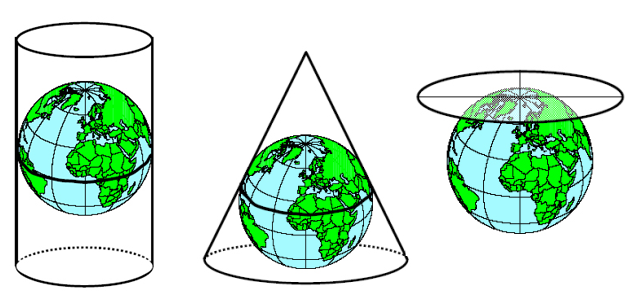

<strong>Map projection families</strong>

Depending on the shape of the graticule, the &nbsp;are several important families.

<ul>
<li style="text-align: justify;"><strong>Simple projection</strong> A projection surface is represented by the developed surface touching or intersecting a sphere. It is associated with the cylindrical, azimuthal, and conic projections.</li>
</ul>

Cylindrical equal-area projection: 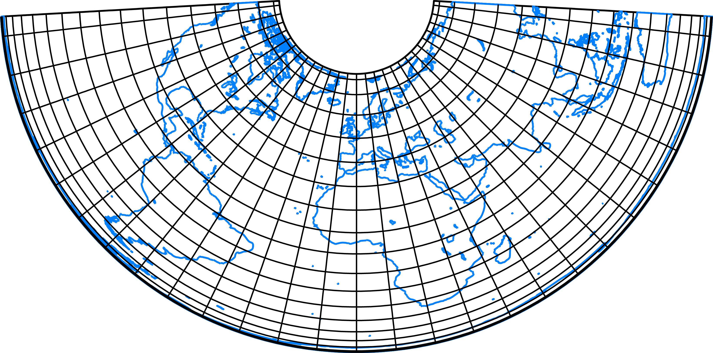 

<ul>
<li style="text-align: justify;"><strong>Pseudo projections</strong> Sometimes, a concept of the auxilliary gemetrical solids is not available, but some analogies remains. To avoid shape distortions, several refinements can be found in the inherited families: pseudocylindrical, pseudoconic, pseudoazimuthal.</li>
</ul>

Bonne projection: 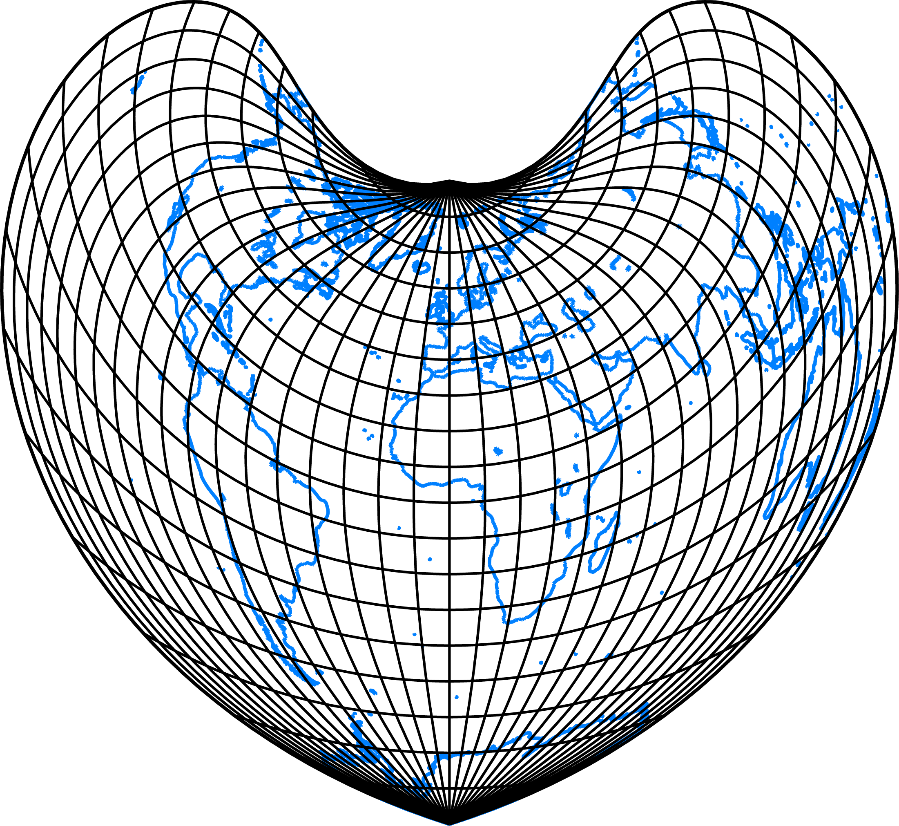 

<ul>
<li><strong>Globular projections</strong> Showing a hemisphere bounded by a circle, they belong to the oldest-known projections using easily drawn curves.</li>
</ul>

Apianus projection:

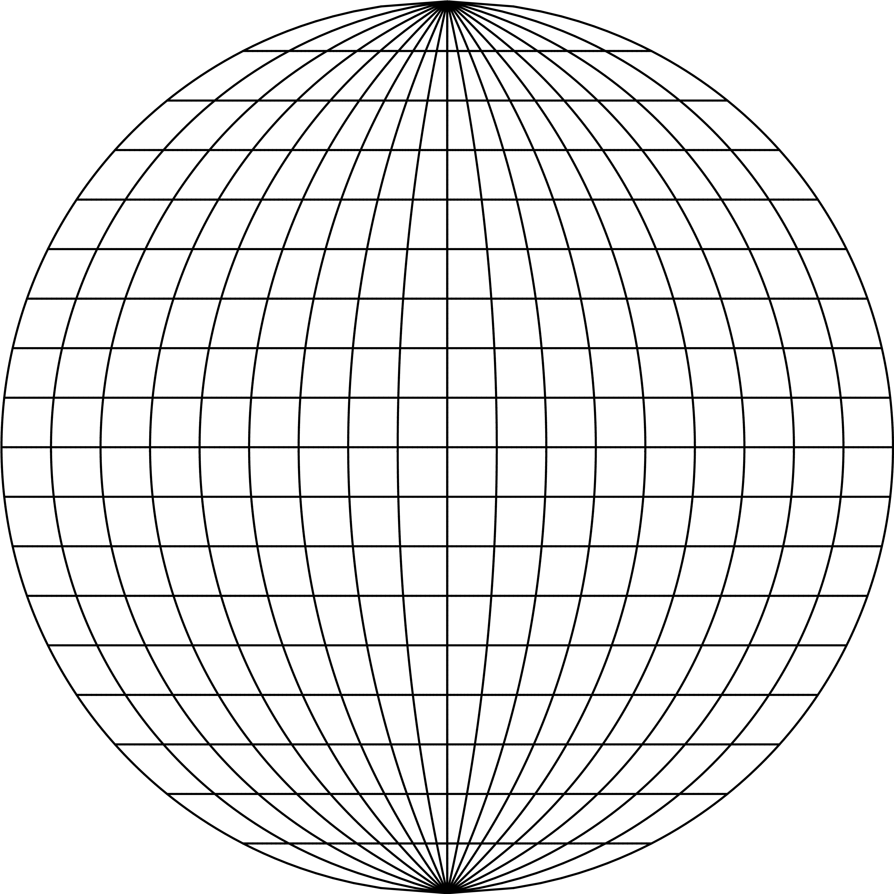

<ul>
<li style="text-align: justify;"><strong>Perspective projections</strong> Some cylindrical or azimuthal projections may be derived using a perspective, when the sphere is projected to a part of the cylinder. &nbsp;The plane may touch the sphere, but a secant forms are also known.</li>
</ul>

Wetch projection:

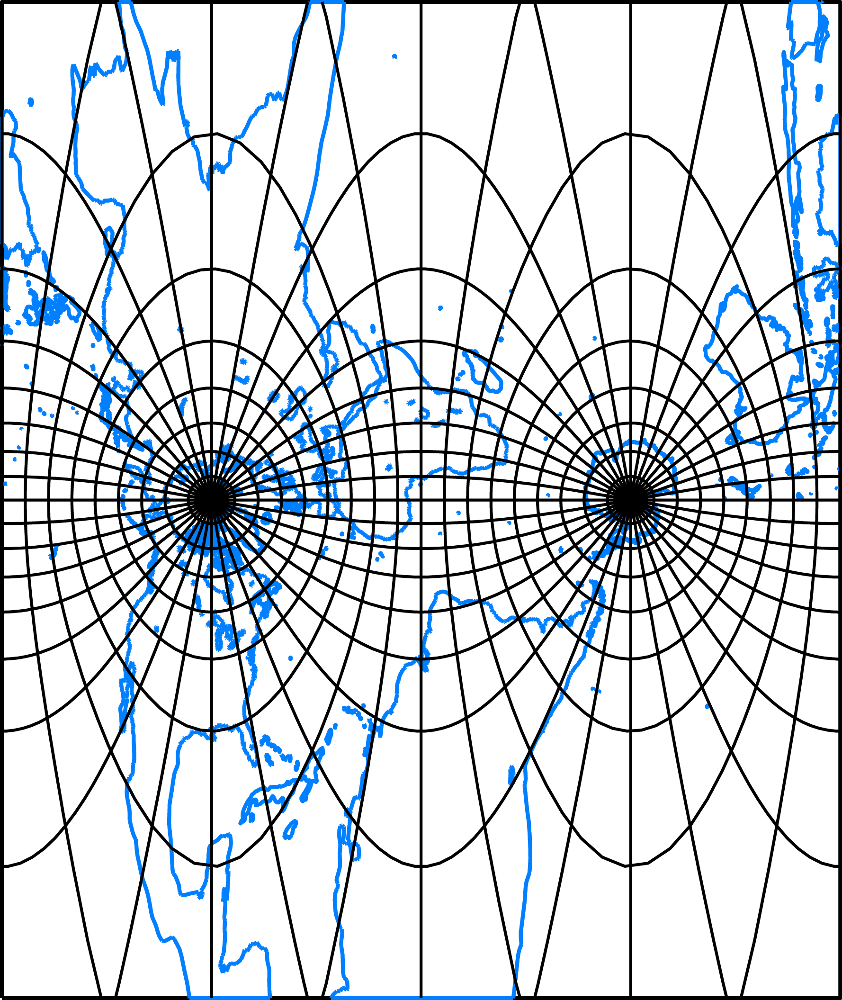

<ul>
<li><strong>Polyconic projections</strong> The sphere is projected to the plane with infinitely many cones tangent to each parallel. In other words, the map is split into many strips each tangent to a different cone. The typical shape of the polyconic projections, a sliced apple, can easily be recognized.</li>
</ul>

Hassler projection:

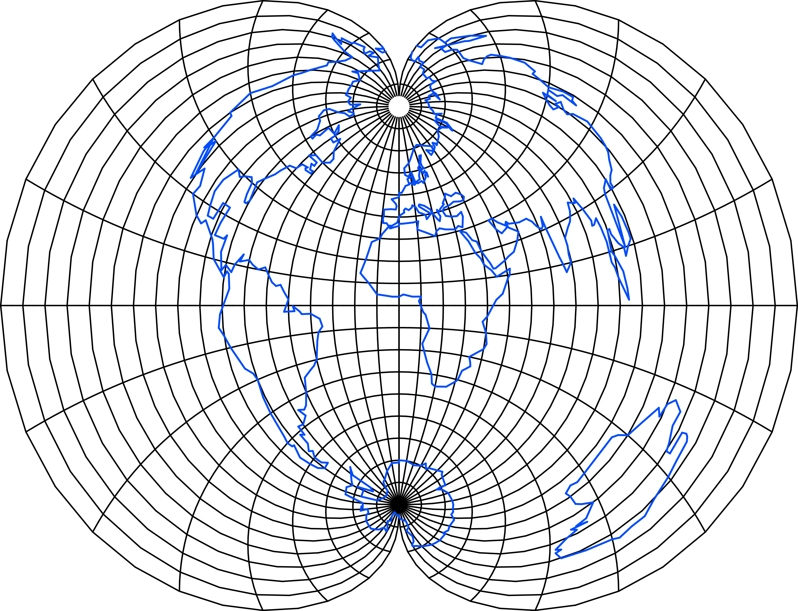

<ul>
<li><strong>Modified azimuthal</strong> They are based on a geometric modifications of azimuthal projections, different than for pseudoazimuthal projections. Providing a natural depiction the entire planisphere they are used &nbsp;for worls maps.</li>
</ul>

Aitoff projection:

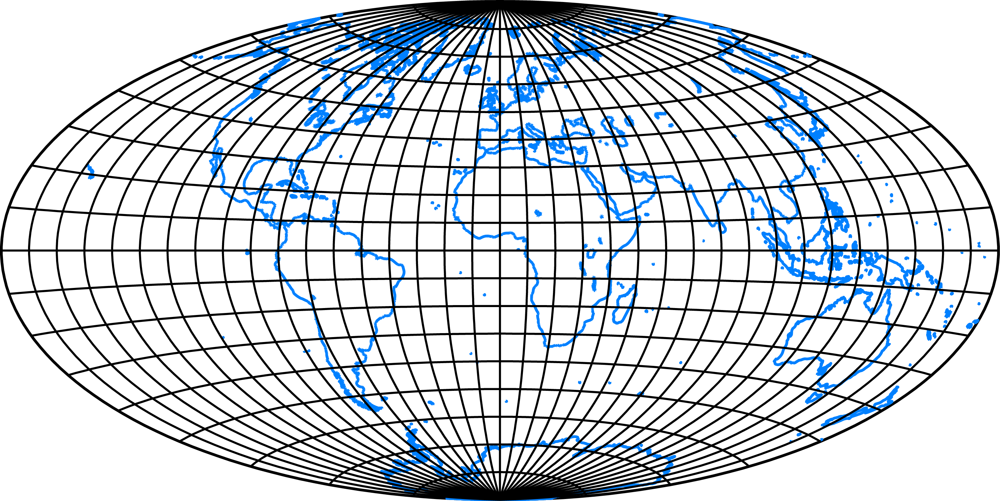

<ul>
<li><strong>Interrupted projections</strong> They are based on idea that highly distorted regions may be moved to less-distorted parts near the equator or a central meridian. The sphere is projected per-partes with a common projection or combining several different projections.</li>
</ul>

Good projection:

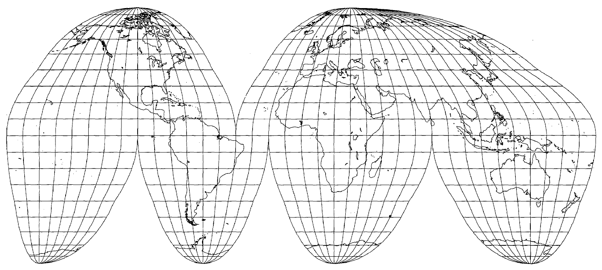

<ul>
<li><strong>Miscellaneous projections</strong> Many projections can not be classified into the above mentioned group. They are based on the different mathematical/geometrical approaches or have a different shape of meridians/parallels/pole.</li>
</ul>

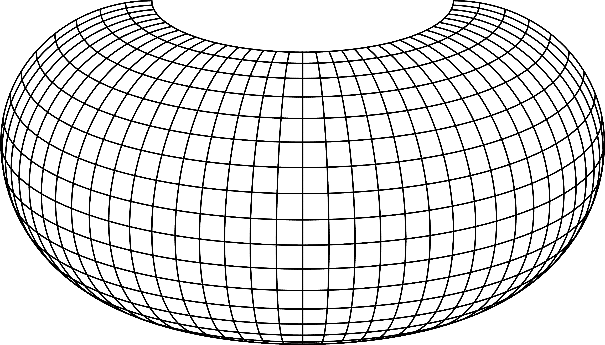

&nbsp;

<strong>Projection aspect</strong>

Map projections are proposed to represent the entire Earth, a hemisphere, continent, or country as accurately as possible. One of the ways to achieve this is an appropriate choice of the projection aspect. There are three projection aspects, which differ in the position of the pole K = [φk, λk]:

<ul>
<li>Normal aspect The projection pole K = [90○, 0○] coincides with the North Pole of the Earth. In connection with azimuthal projections, it is also known as the polar aspect.</li>
<li>Transverse aspect The projection pole K = [0○, λk], λk ∈ [ − 180○, 180○], coincides with the equator and it is also called the equatorial aspect. There are an infinite number of positions of the transverse aspect.</li>
<li>Oblique aspect The projection pole K = [φk, λk], where φk ∈ [ − 90○, 90○], λk ∈ [ − 180○, 180○], is any other point than the North Pole or the equatorial point.</li>
</ul>

The projection aspect has a crucial impact on the graticule shape. In both the transverse and oblique aspects, the shape of the graticule significantly changes; other constant values of the projection are gentler to the shape of the graticule. It is a known fact that projections may lose their orthogonality shapes of the poles, prime meridian, or equator shape.

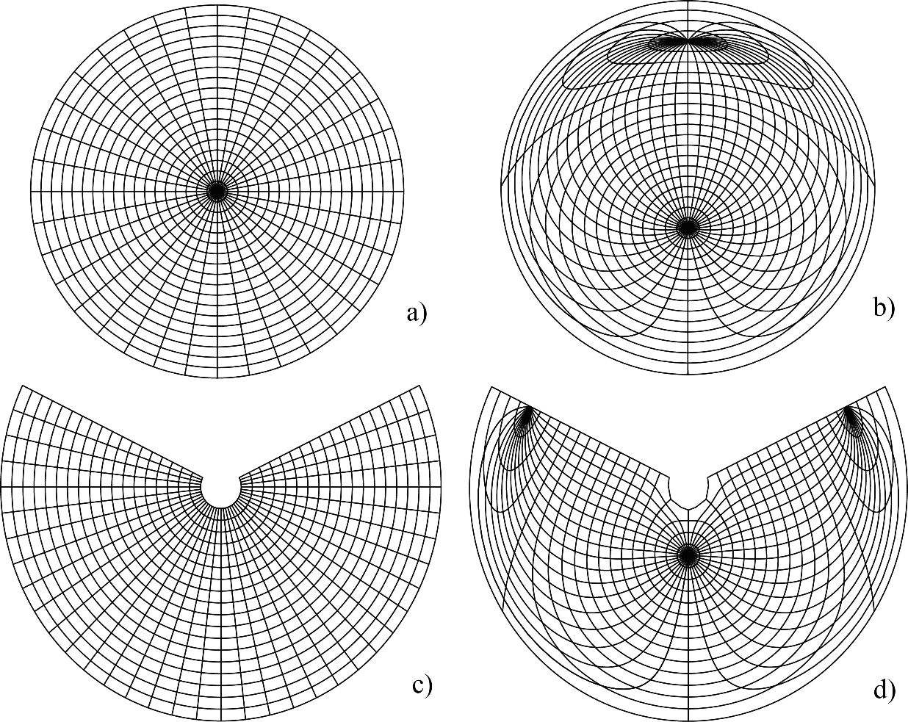

Comparing the azimuthal (a), (b) and conic equidistant (c), (d) projections in the normal and oblique, K=[ 50○, 10○] , aspects; the orthogonality and graticule shapes are not preserved.

